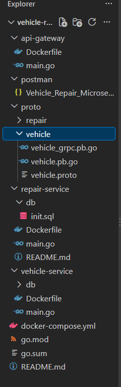

# Vehicle Service & Repair Management System

## WEB303 – Microservices & Serverless Applications 
## Assignment_2

### 1. Project Overview

Vehicle Service & Repair Management System is a microservice application built with Go, gRPC, REST APIs, PostgreSQL, and Docker. There are two independent microservices in the application to manage vehicles and repairs. There is an API Gateway that offers REST API end-points for the clients, and the services internally use gRPC.

### 2. System Architecture
- The application consists of three main components:
#### API Gateway: Receives REST requests via Postman and routes them to the correct microservices via gRPC.
#### Vehicle Service (Service B): Controls vehicles' data and stores it in its database, which is PostgreSQL.
#### Repair Service (Service A): Controls repair data and communicates with the Vehicle Service via gRPC for validation of the vehicles.
- Each microservice has a separate PostgreSQL database. The Repair Service does not access the Vehicle Service database directly.

### 3. Technologies Used
- Go – Microservice and API Gateway programming.
- gRPC and Protobuf – Service-to-service communication.
- REST API – Client communication via API Gateway.
- PostgreSQL – Standalone database per microservice.
- Docker – Containerization.
- Docker Compose – Multicontainer deployment.
- Postman – Testing REST API.
- Git and GitHub – Version control of source code.

### 4. Microservices

#### Vehicle Service 

- The Vehicle Service manages vehicle information.

**Vehicle fields:**

- id
- registration_number
- owner_name
- model
- year
- It supports Create, Read, Update, Delete, and List operations using gRPC.

#### Repair Service
- The Repair Service manages vehicle repair jobs.

**Repair job fields:**

- job_id
- vehicle_id
- problem_description
- repair_status
- cost
- created_at
- It supports Create, Read, Update, Delete, and List operations using gRPC.

### 5. API Gateway Endpoints
- The API Gateway runs on port **18080**.

#### Vehicle Endpoints

| Method | Endpoint | Description |
|---|---|---|
| POST | `/vehicles` | Create a vehicle |
| GET | `/vehicles` | List all vehicles |
| GET | `/vehicles/{id}` | Retrieve a vehicle |
| PUT | `/vehicles/{id}` | Update a vehicle |
| DELETE | `/vehicles/{id}` | Delete a vehicle |

#### Repair Endpoints

| Method | Endpoint | Description |
|---|---|---|
| POST | `/repairs` | Create a repair job |
| GET | `/repairs` | List all repair jobs |
| GET | `/repairs/{id}` | Retrieve a repair job |
| PUT | `/repairs/{id}` | Update a repair job |
| DELETE | `/repairs/{id}` | Delete a repair job |

#### Base URL:

`http://localhost:18080`

All Postman REST requests are sent through the API Gateway.

### 6. Resilience Mechanisms
- Resilience techniques are employed by the Repair Service while communicating with the Vehicle Service.
- Time-out:Every gRPC request from Vehicle Service has a time out of two seconds.
1. Retry with exponential back-off:Failing requests can be re-tried up to three times with an incremental delay of 200 milliseconds and 400 milliseconds respectively.
2. Circuit Breaker:The circuit breaker is triggered after three failure events and stays open for ten seconds.

## 7. Input Validation and Error Handling
- Incoming data is checked before performing any database operations.
- Some examples of invalid repair data are:
1. No problem description.
2. Invalid vehicle ID.
3. Negative repair cost.
4. Unacceptable repair status.

### 8. Database Design
- The system uses two independent PostgreSQL databases.
1. Vehicle Database (vehicle_db)
2. Repair Database (repair_db)
- Each microservice connects only to its own database. Communication between microservices is performed through gRPC.

### 9. Running the Application

#### Prerequisites
- Docker Desktop with Docker Compose
- Git
- Postman for testing

#### Step 1: Clone the repository
git clone: https://github.com/choden12/assignment2-WEB303.git

#### Step 2: Start the application
- Make sure Docker Desktop is running.
##### Execute:
**docker compose up --build**
**Docker Compose builds and starts:**
- Vehicle PostgreSQL database
- Repair PostgreSQL database
- Vehicle Service
- Repair Service
- API Gateway

##### The API Gateway becomes accessible at:
- http://localhost:18080

#### Step 3: Test the REST API
##### Open Postman and send:
- GET http://localhost:18080/vehicles
##### To retrieve repair jobs:
- GET http://localhost:18080/repairs
##### To create a vehicle:
- POST http://localhost:18080/vehicles
- Content-Type: application/json

#### 10. Postman Collection
##### The exported Postman collection is available at:
- postman/Vehicle_Repair_Microservices_API.postman_collection.json.
- Import this file into Postman to access the Vehicle and Repair REST API requests.

## 11. Project Structure

## 12. Conclusion
- This Vehicle Service and Repair Management System exemplifies a microservices design that involves Go, gRPC, separate PostgreSQL database instances, and a REST API Gateway. The app provides CRUD functionality, input validations, inter-service communications, resilience measures, and deployment using Docker Compose.